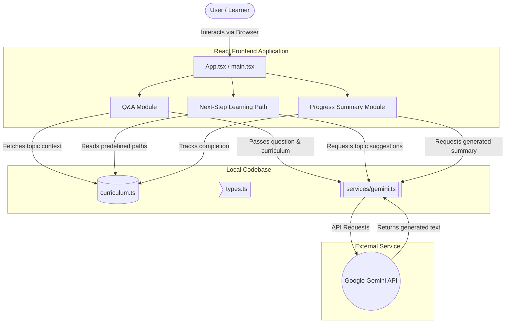

# AI Personal Learning Assistant

[cite_start]The AI Personal Learning Assistant is a beginner-friendly, intelligent tool designed to help learners understand topics, ask questions, and track their educational journey[cite: 3]. [cite_start]The goal is to create a supportive environment that enhances the learning experience using AI[cite: 4].

---

## 🚀 How to Run the Solution

### Prerequisites
Before you begin, ensure you have the following installed:
* **Node.js** (v18.0 or higher recommended)
* **npm** (v9.0 or higher) or **Yarn**
* A valid **Google Gemini API Key**

### Installation Steps
1.  Clone the repository:
    ```bash
    git clone [https://github.com/yourusername/ai-learning-assistant.git](https://github.com/yourusername/ai-learning-assistant.git)
    cd ai-learning-assistant
    ```
2.  Install dependencies:
    ```bash
    npm install
    ```

### Environment Configuration
1.  Create a `.env` file in the root directory of the project.
2.  Add your Google Gemini API key:
    ```env
    VITE_GEMINI_API_KEY=your_api_key_here
    ```

### Development Commands
To start the local development server with hot-module reloading:
```bash
npm run dev
```

Here is the fully formatted Markdown code for your README.md file, incorporating all those sections along with a detailed Architecture section that includes the Mermaid.js diagram we discussed earlier.You can copy and paste everything inside the block below directly into your repository.


## 🚀 Production Build Instructions

To create an optimized production build:
```bash
npm run build
npm run preview # To preview the production build locally
🛠 Tech StackFrontend Framework & CoreTechnology  DescriptionVersion (approx.)ReactCore UI library^18.2.0TypeScriptStatic typing for JavaScript^5.0.2ViteBlazing fast build tool and dev server^4.4.5Styling & UITechnologyDescriptionVersion (approx.)Tailwind CSSUtility-first CSS framework^3.3.0Framer MotionProduction-ready animation library^10.16.0Lucide ReactBeautiful, consistent icon toolkit^0.290.0AI IntegrationTechnologyDescriptionGoogle Gemini APIPowers the core Q&A and reasoning engine
✨ Features ImplementedAI-Powered Learning Assistant: Acts as the core conversational agent, providing clear, accurate, and beginner-friendly answers to user queries.Curriculum Structure: A predefined, static knowledge base that the AI relies upon. The assistant is strictly constrained to answer only within this curriculum content.Smart Recommendations: Automatically suggests the next topics or learning steps based on the user's current topic, difficulty level, and progress.Progress Tracking System: Monitors what the user has learned, identifying attempted topics, questions asked, and highlighting pending areas.Interactive Views: Features distinct Dashboard and Learning views for seamless navigation between tracking progress and consuming study material.
Chat Summaries: System generated, simple summaries of the topics the learner has completed and their overall progress.Responsive Design: Fully fluid UI that works flawlessly across desktop, tablet, and mobile devices.Animations & UX: Smooth transitions, loading states, and micro-interactions powered by Framer Motion to keep the user engaged.Context-Aware Q&A: The chat interface maintains conversation history within a session to provide contextual answers based on the curriculum material.
```


## 📁 Project StructurePlaintext├── src/
``` bash
│   ├── components/      # Reusable React components (UI, Chat, Dashboard)
│   ├── services/
│   │   └── gemini.ts    # AI API client and prompt engineering logic
│   ├── curriculum.ts    # Static learning path and content database
│   ├── types.ts         # TypeScript interfaces and data models
│   ├── App.tsx          # Main application component and routing logic
│   ├── main.tsx         # React entry point
│   └── index.css        # Global styles and Tailwind imports
├── .env                 # Environment variables (not tracked in Git)
├── index.html           # HTML template
└── package.json         # Project dependencies and scripts

```


## 🏗 Architecture

The application follows a client-side architecture where the React frontend manages state and user interactions. The `curriculum.ts` file acts as a local, static database. User inputs and curriculum context are packaged and sent to the Google Gemini API via `gemini.ts`, which acts as the intelligent processing layer to return answers and recommendations.



---


## 📖 How to Use Select a Topic: 
Open the application and choose a topic from the Dashboard or Learning view.Read & Learn: Review the curriculum material presented on the screen.Ask Questions: Use the chat interface to ask any questions. The AI will answer based only on the provided material.Track Progress: Check the dashboard to see your generated learning summary and follow the AI's suggestions for your next steps.


## 🔒 Security NotesAPI Key Protection:
The Google Gemini API key is stored in the .env file and prefixed with VITE_ to be accessible to the frontend build. Do not commit your .env file to version control.Production: For a true production environment, consider moving the Gemini API calls to a secure backend to completely hide the API key from the client browser.


## 🚀 Future EnhancementsBackend Integration: 
Replace the static curriculum.ts with a dynamic database (like PostgreSQL) to support multiple courses and user accounts.User Authentication: Implement secure login to save progress across different devices.Rich Media Support: Allow the AI to suggest video links or interactive coding snippets.
